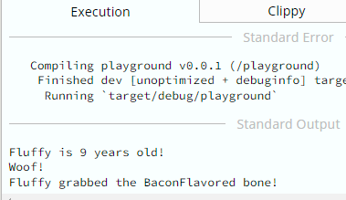

<!--
theme: default
class:
 - invert
headingDivider: 2 
paginate: true
-->

<!--
_class:
 - lead
 - invert
-->

# A Crash Course in Rust 🦀

Let's learn [Rust](https://www.rust-lang.org/) together. 

## What is Rust?

- Systems programming language
- Strongly typed
- No garbage collector
- Immutable by default
- Memory safety is checked at compile time
  - Prevents `undefined behavior`
    - Use after free (dereferencing a null pointer)
    - Data races
- Async/Await for high performance apps
  - Core IPC message broker
- Package management
- Workspace configuration

## Installation

- [Rustup](https://rustup.rs/)

```bash
curl --proto '=https' --tlsv1.2 -sSf https://sh.rustup.rs | sh
rustup default stable # Install and use the latest stable rust toolchain
```

## Tooling

<!-- >
  - Language server for rust that provides IDE like features using JSON-RPC with editor plugins that support Microsoft's language server schema.
-->

- Visual Studio Code
- `rust-analyzer` extension
  - Language server for rust 
  - Provides IDE-like features
    - Intellisense
    - Goto Definition
    - Refactoring support
    - Inlay type hints

## Creating a Project

```
cargo new learn-rust
cd learn-rust
cargo run -r
```

## Data Structures

<!-- Everyone loves pets, so let's start by adding a pet to our project. -->

:dog: 

```rust
// main.rs
struct Dog;

fn main() {
    let _dog = Dog {};

    println!("Hello, world!");
}
```

## Mutability, Functions, and Birthdays

<!-- 
  Let's give our dog an age and make it possible for them to celebrate their birthday. 
  Note that we have to add the mut keyword to the dog to be able to mutate it. In this case, the mutation is incrementing its age when celebrating its birthday.

  In Rust, objects are immutable by default.
-->

🎂

```rust
struct Dog {
    age: u8,
}

impl Dog {
    pub fn celebrate_birthday(&mut self) {
        self.age = self.age + 1;
        println!("Fluffy is {} years old!", self.age);
    }
}

fn main() {
    let mut dog = Dog { age: 8 };
    dog.celebrate_birthday();
}
```

## Constructors

<!--
Constructors in Rust are just functions that return an instance of an object. They are not treated specially by the language itself like they are in C++.

Because they do not take `self` as a parameter,
they are considered `associated functions` instead of `methods`.
-->

```rust
struct Dog {
    age: u8,
}

impl Dog {
    pub fn new(age: u8) -> Self {
        Self { age }
    }

    pub fn celebrate_birthday(&mut self) {
        self.age = self.age + 1;
        println!("Wiggly butt is {} wags old!", self.age);
    }
}

fn main() {
    let mut dog = Dog::new(8);
    dog.celebrate_birthday();
}
```

## Enumerations

<!-- Now we can add an enumeration to our program the represents various bone flavors. -->

```rust
enum BoneKind {
    Bacon,
    PeanutButter,
    Turkey,
}
```

## Option

<!--
Now we need a way to represent the dog having a bone or not having a bone.
We can represent this using the `Option` type.

`Option` is a generic enumeration with two variants.
-->

```rust
pub enum Option<T> {
  None,
  Some(T),
}
```

## Optional Fields

<!-- Let's add an optional `bone` field to our `Dog`. -->

```rust
struct Dog {
    age: u8,
    pub bone: Option<Bone>,
}

impl Dog {
    pub fn new(age: u8) -> Self {
        Self { age, bone: None }
    }

    // ...
}

fn main() {
    // ...
}
```

## Wait a second...

<!--
Now our dog can hold onto a Bone!

However, things get more complicated when we want to start giving and taking bones.

What if the dog already has a bone?
What if the dog doesn't like the flavor?
What if the dog refuses to take the bone?

In the next section, we'll cover how to handle fallibility in our program.

First, we will take a look at the full program so far.
-->

* What if the dog already has a bone?
* What if the dog doesn't like the flavor?
* What if the dog refuses to take the bone?

## Full Program

```rust
struct Dog {
    age: u8,
    pub bone: Option<Bone>,
}

impl Dog {
    pub fn new(age: u8) -> Self {
        Self { age, bone: None }
    }

    pub fn celebrate_birthday(&mut self) {
        self.age = self.age + 1;
        println!("Wiggly butt is {} wags old!", self.age);
    }
}

struct Bone {
    kind: BoneKind,
}

impl Bone {
    pub fn new(kind: BoneKind) -> Self {
        Self { kind }
    }
}

enum BoneKind {
    BaconFlavored,
    TurkeyAndStuffing,
    PeanutButter,
}

fn main() {
    let mut dog = Dog::new(8);
    dog.celebrate_birthday();
}
```

## Results and Errors

<!--
Now we want to be able to give the dog a bone and take it away to throw for fetching. These operations can fail for various reasons.

We can represent fallible operations by making them return a Result type, and we will specify our own Error type.
-->

- How do we represent errors in Rust?
- Scenario 1
  - We take a bone but the dog does not have one. What should we get back?
    - We can return a `None` variant of `Option` to represent the absence of the bone.
- Scenario 2
  - We give a dog a bone, but it already has one? What should we get back?
    - We can return the `Err` variant of a `Result` type, to represent an error.
- `Result` can represent fallible operations

```rust
enum Result<T, E> {
   Ok(T),
   Err(E),
}
```

## Traits

<!--
To understand the next section explaining errors, we'll need to discuss the concept of traits. Traits are like interfaces in other languages, except in Rust, traits only specify behavior and not data. Traits only represent functions and not variables. There is a `std::error::Error` trait that the Result type uses as a type-constraint on its generic Error parameter. Result can only accept error types that implement the `std::error::Error` trait.

For us to create a custom error type we have to implement the `std::error::Error` trait on our AnimalError custom error type.

We can implement other similar traits as well, such as Display. Display specifies how an object should present itself in a user-facing for text. The equivalent for debugging is called Debug.

Traits allow rust to use dynamic dispatch, which is the process of selecting which implementation of a polymorphic operation (method or function) to call at run time.
-->

- What are traits?
  - Similar to interfaces
  - Only specify behavior and not data
  - Not inheritance
  - Allows for dynamic dispatch of types
    - i.e `Vec<Box<dyn Animal>>`
- Built-In Rust traits
  - Default
  - Display
  - Copy
  - Clone

## Custom Errors

<!--
To represent an error when interacting with an animal, we can create a custom error type.
Here we have a custom `AnimalError` type that stores a string for error details.
We also implement Display on it so it can be printed to the console.
-->

```rust
struct AnimalError {
    details: String,
}

impl AnimalError {
    fn new(msg: &str) -> Self {
        Self {
            details: msg.to_string(),
        }
    }
}

impl std::error::Error for AnimalError {
    fn description(&self) -> &str {
        &self.details
    }
}

impl std::fmt::Display for AnimalError {
    fn fmt(&self, f: &mut std::fmt::Formatter) -> std::fmt::Result {
        write!(f, "{}", self.details)
    }
}
```

## Type Aliases

<!-- To prevent us from having to write the full signature for a Result that uses our custom error type, we can create a type alias at the module root to shorten the signature. -->

Declare function aliases to abbreviate ubiquitous types.

```rust
pub type Result<T, E = Box<dyn std::error::Error>> = std::result::Result<T, E>;
```

Box?

### Smart Pointers in Rust

- What is a `Box`?
  - Just a smart pointer 🧠👈😎
  - Used for safe heap allocations

<!--
In rust, a `Box` is a smart pointer to a heap allocated value of a particular type. This is a value on the `stack` that holds the starting address of a contiguous region of `heap` memory as well as its length. When a box goes out of scope, its destructor is called, the inner object is destroyed, and the memory on the heap is freed. This prevents double free and use after free errors without any extra code.

Rust must know the sizes of all values on the stack at compile time.
Trait objects can vary greatly in size depending on what data structures
they are implemented for. To make them all a known size at compile time,
they are contained in a `Box`.
-->

## Writing Fallible Methods

<!-- With all that in mind, we can now write out methods for giving and taking a bone from a dog. -->

```rust
pub fn receive_bone(&mut self, bone: Bone) -> Result<()> {
    match self.bone.as_ref() {
        Some(bone) => {
            return Err(Box::new(AnimalError::new(&format!(
                "Dog already has a bone! ({:?})",
                bone
            ))))
        }
        None => {
            println!("Fluffy grabbed the {:?} bone!", bone.kind);
            self.bone = Some(bone);
        }
    };
    Ok(())
}
```

## More Error Conditions

<!-- Naturally, the dog won't be able to speak while holding the bone. So let's add that now. -->

```rust
pub fn speak(&self) -> Result<()> {
  match self.bone.as_ref() {
      Some(bone) => Err(Box::new(AnimalError::new(&format!(
          "Dog can't speak because of the {:?} bone!",
          bone
      )))),
      None => Ok(println!("Woof!")),
  }
}
```

## Happy Birthday, Fluffy! 🍰🐕

<!-- 
Now we can invoke these methods in main with a slight change to the return type of main.
Note that the ? operator can invoke fallible methods and forward their errors to the caller if they fail. We can call dog.speak()? now because main has a return type of Result<()>.

The function must return a Result, so at the end we use the Ok() variant of Result
with the empty type represented by a pair of parentheses like in the signature.
-->

```rust
fn main() -> Result<()> {
    let mut dog = Dog::new(8);
    dog.celebrate_birthday();
    dog.speak()?; // Now we can invoke dog.speak()

    let bone = Bone::new(BoneKind::BaconFlavored);
    dog.receive_bone(bone)?;

    Ok(())
}
```

- What is `?` ????
  - Sugar for methods returning `Result`
  - Propagates error to the caller if they fail

## Debug Output

<!--
Earlier we mentioned that we could get debug representations of types by implementing the Debug trait.

Luckily, there is an easy way to automatically derive this trait for structs made of primitives or other structs that implement Debug that we can add to the rest of our structs and plain enums.
-->

```rust
#[derive(Debug)] // <-- Add this to any struct or plain enum you want to print debug string output for
struct AnimalError {
    details: String,
}
```

## Final Program

Available on the [rust playground](https://gist.github.com/ab843b1835c9cd453f1c4ca952f73f9a) 🚀



## Next Steps

- The [official rust website](https://www.rust-lang.org/)
- The Rust bookshelf
  - Run `rustup doc`
- [Awesome Rust Learning](https://github.com/ctjhoa/rust-learning)
  - Large list of learning resources

<!-- 
Rustup doc will open a page in the browser containing a large collection of standard, official documentation and rust learning resources.
-->